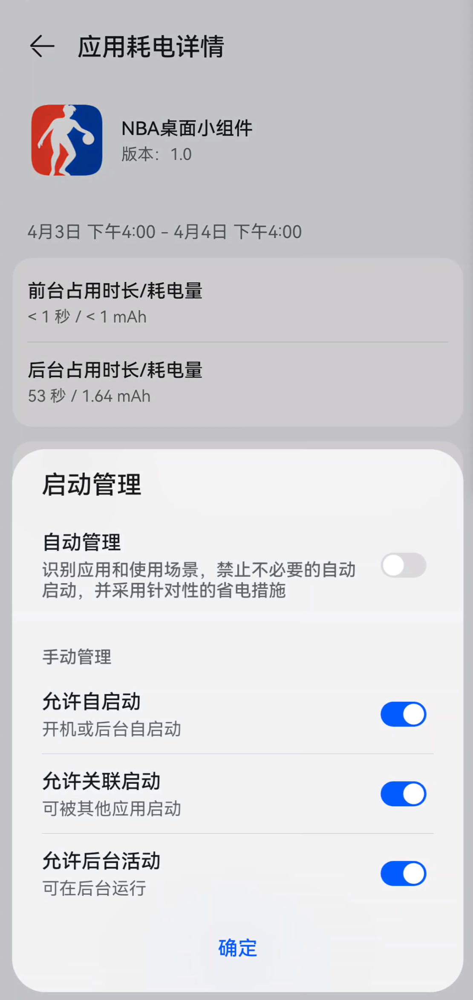

# NBA桌面小插件

<p align="center">
  
  <br>
  <em>实时比赛比分预览（3D）</em>
</p>


<p align="center">
  
  <br>
  <em>实时比赛比分预览（2D）</em>
</p>


---

## 🏀 功能特性
- **logo动画**：每分钟自动刷右侧动画，每小时刷新左侧动画
- **多场比赛追踪**：可随意切换任意30支球队，实时关注比分
- **低功耗模式**：仅在屏幕唤醒的时候会切换动画，手动点击【星期N】出现实时比分
- **点击交互**：点击右侧【秒区】可以挑转到虎扑app

---

## 📥 安装指南

### 要求
- Android 12+
- 至少 4x2 的桌面空间

### 步骤
1. 下载最新APK：[Releases页面](https://github.com/dianbaiyizhong/nba-widgets/releases/tag/v1.1.8)
2. 选择尺寸（推荐 4x2）并放置到桌面
3. 开启所有权限，例如华为手机需要关闭省电模式，这样可以让定时器准时触发，如下图所示


<p align="center">
  
  <br>
  <em>实时比赛比分预览（2D）</em>
</p>


## 🔌 数据来源
- 官方数据源：通过 `NBA Stats API` 实时获取（怎么可能有这种接口，文档模板占个空间而已）

  

---

## 📸 截图示例

<p align="center">
  
  <br>
  <em>首页</em>
</p>


---

## 🛠️ 开发者文档

### 如何发布并触发github action来打包apk版本
```bash
git tag v1.0.0
git push origin v1.0.0
```


## ❓ 常见问题

<details>
<summary><b>push报错：Support for password authentication was removed on August 13, 2021.？</b></summary>
github上点击进入Settings==》Developer Settings==》Personal access tokens (classic)，重新生成一个密码来作为登陆密码


